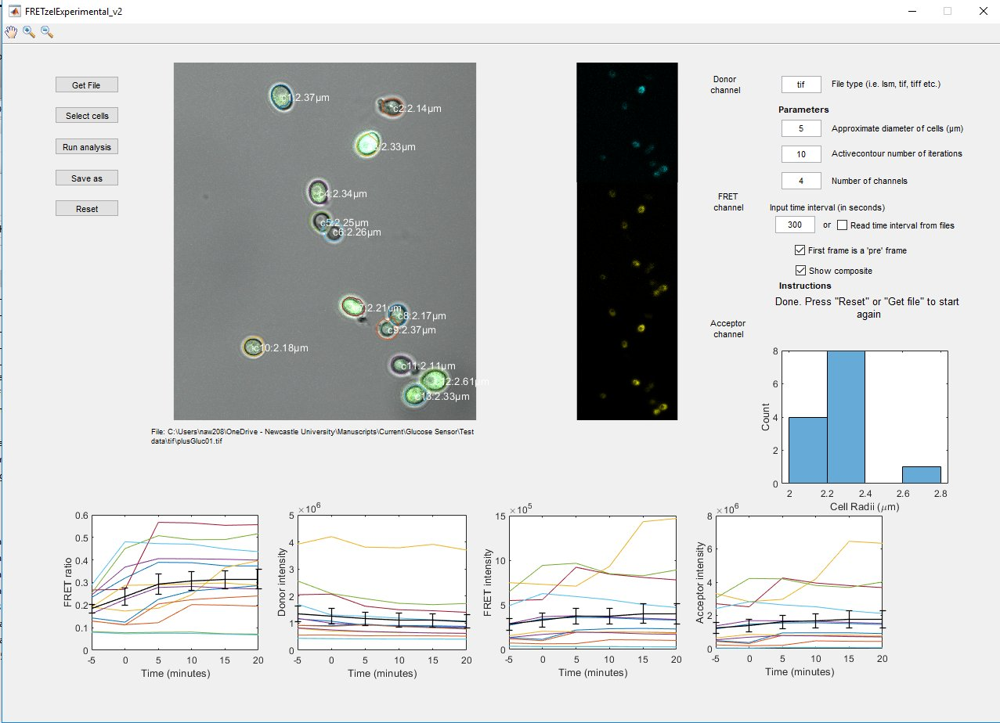

# Guide to test data

## tif
The folder tif contains two image files containing test data of yeast cells expressing the glucose sensor. These cells were glucose starved and then exposed to glucose, creating an increase in FRET signal over time.

## sample output
This folder contains the output files generated from analysing the data.

## Running test data
Open FRETzel and click Get File. Select the first image in the tif folder. Set the parameters to match the screenshot below. Follow the user guide instructions as normal. Run time should be near instant, although lots of cells and high numbers of active contour iterations may slow to a few minutes.

