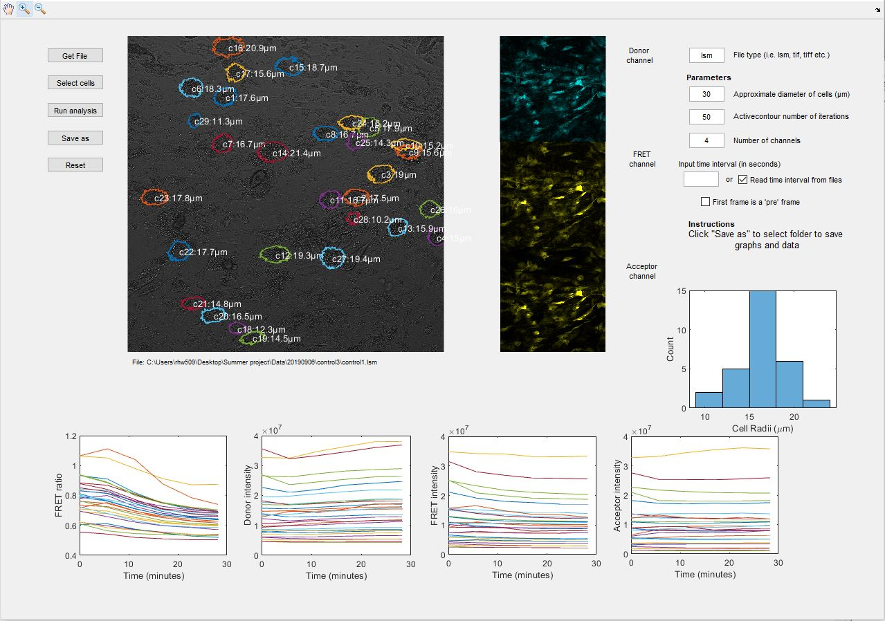

# FRETzel
MATLAB guided user interface that performs cell segmentation and FRET analysis of cells. 

Useful for identifying cells from brightfield images in messy and crowded data sets, such as those produced in cultures of adipocytes but works on other cells, including yeast.

See [Getting started](GettingStarted.md) and [User guide](UserGuide.md) in docs for more information.

Using Open Microscopy Environment Bio-Formats MATLAB toolbox to open microscopy files. See https://www.openmicroscopy.org/bio-formats/downloads/.

